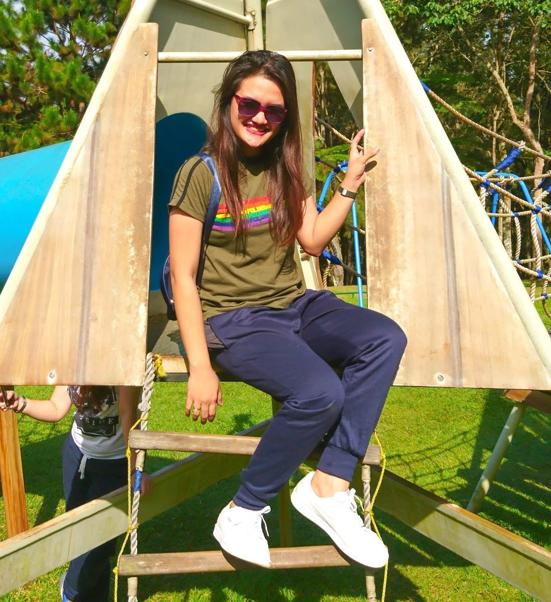

# Ray_portfolio
Data Science portfolio

# PROJECT 1: Create a simple Natural Language Processing--Sentiment Analysis using Twitter API
  [Sentiment Analysis using Twitter API](https://classroom.google.com/u/1/c/MTMxMTczMjgwMzEy/a/MTkzMzczNjIxNzAz/details)

# PROCJECT 2: Caeser Cipher
  [Caeser Cipher](https://classroom.google.com/u/1/c/MTMxMjM4OTQ2Mzc0/a/MjMxMDM4ODQ2OTc3/details)

# PROCJECT 3: Python AES Encryption/Decryption using PyCrypto
  [Python AES Encryption/Decryption using PyCrypto](https://classroom.google.com/u/1/c/MTMxMjM4OTQ2Mzc0/a/MjMxMDMxNzExODMz/details)

# PROJECT 4 : Christmas Sentiment Analysis---PreFinal
  [Christmas Sentiment Analysis](https://classroom.google.com/u/1/c/MTMxMTczMjgwMzEy/a/MTY1MDc0OTgzNzQ4/details)
